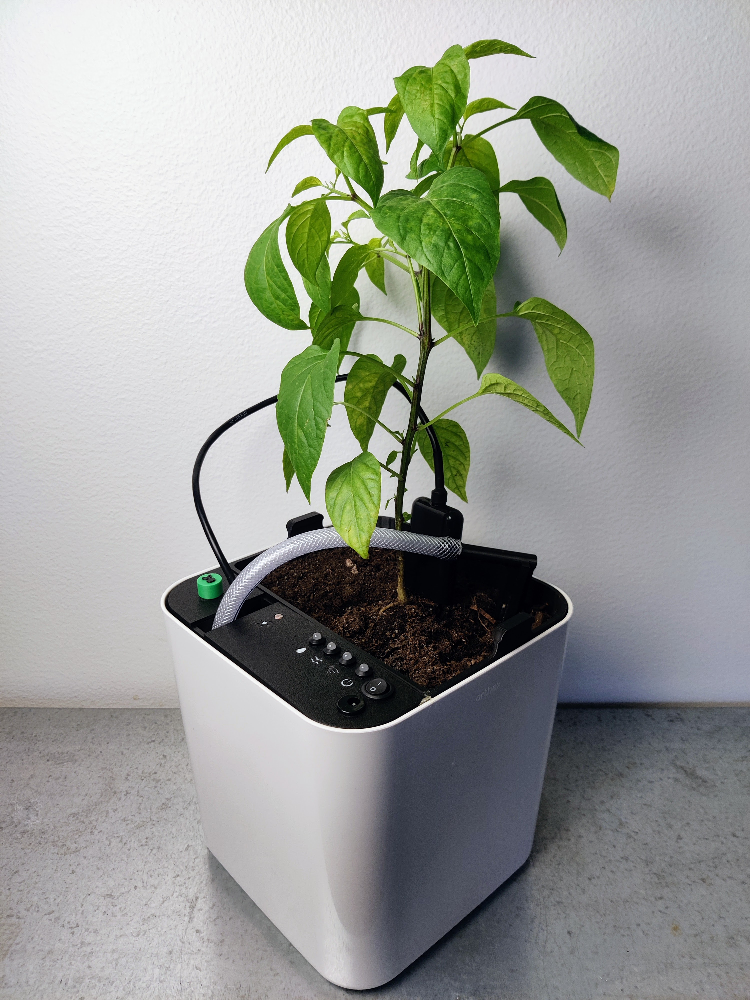

# IoT-pot

## Description

The IoT-pot is a smart plant pot that allows you to monitor your plant's health and it's environment. The pot will automatically water the plant when needed and sends notifications to the user when the environment changes or the water tank is close to empty.

The system consists of the pot device, a configuration app and a monitoring app. The pot itself acts as a WiFi access point and as a local web server that hosts the configuration app. The monitoring app is a web app available at [iot-pot.com](https://iot-pot.com).

IoT-pot was created by the authors for Chydenius (JYU) university course `TIES4571 IoT-projekti`.

## Development

Use Visual Studio Code and the [Platform IO extension](https://docs.platformio.org/en/stable/integration/ide/vscode.html).

The code consists of the device code, configuration app code and the monitorgin app code, all in the same repo.

## Git workflow

No direct pushes to the `main` branch.
Let´s use feature branches: create a new branch for each new feature.

### When you start to develop a new feature:

1. Make sure your `main`is up to date, then create a new branch based on `main`
2. Name the branch for example: `feature/my-new-feature`
3. When you are done, make sure everything works and compiles, then push the branch to Gitlab
4. Log into the Gitlab web app and create a Merge Request to merge your branch `feature/my-new-feature` into the `main` branch

## Secrets

Do not commit secrets, passwords, API keys etc into Git. Create a file called `secrets.h` in [/include](./include), this file should contain all secrets and the file is ignored by Git. See the file [./include/secrets.h.template](./include/secrets.h.template) for a template.

## Device code

The device code is written in C++ using the Arduino framework, see [/src](./src/). Sensor specific header files can be found in [/include](./include/)

## Configuration app

See [/src/html](./src/html)

## Monitoring app

See [/monitoring-app](./monitoring-app)

## Authors

Okko Ojala - Lead developer, system architecture, UX-UI design, hardware
Susan Paloranta - Developer, testing
Bella Lerch - Product owner, testing
Antti Leppänen - Hardware, 3D-design and printing, testing
Katja Hellsten - Project manager, testing
